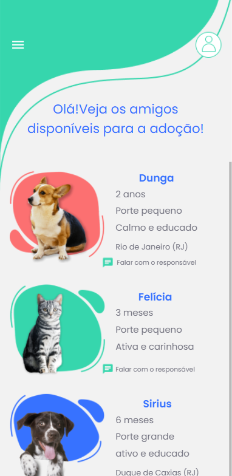

React Native: Tela Home Adopet

ADOPET - Uma rede social para adotantes encontrarem cachorros ou gatos para adoção.

🔨 Funcionalidades do Projeto
Nesta parte do projeto desenvolvemos a tela home da aplicação.

✔️ Técnicas e Tecnologias Utilizadas
Durante esse curso utilizaremos:

* React Native
* Expo

🎨 Link do Figma

[ Clique aqui para acessar o Figma do projeto ](https://www.figma.com/design/pFN8N6ePPzP3EPbWOMa0Us/Adopet-%7C-Rotas-com-React-Native--Copy-?node-id=24535-147&t=nvOEgrQPEy4StQkI-0)

🛠️ Como Abrir e Rodar o Projeto

Para abrir e rodar o projeto, execute npm install para instalar as dependências e npx expo start para iniciar o projeto.

Depois, selecione a opção "a" no terminal para abrir o emulador, "w" para abrir versão web ou escaneie o QR Code no aplicativo Expo.

📚 Mais Informações sobre o Curso
O Adopet é uma rede social fictícia. A ideia principal é praticar os conceitos aprendidos em sala de aula com React Native.

